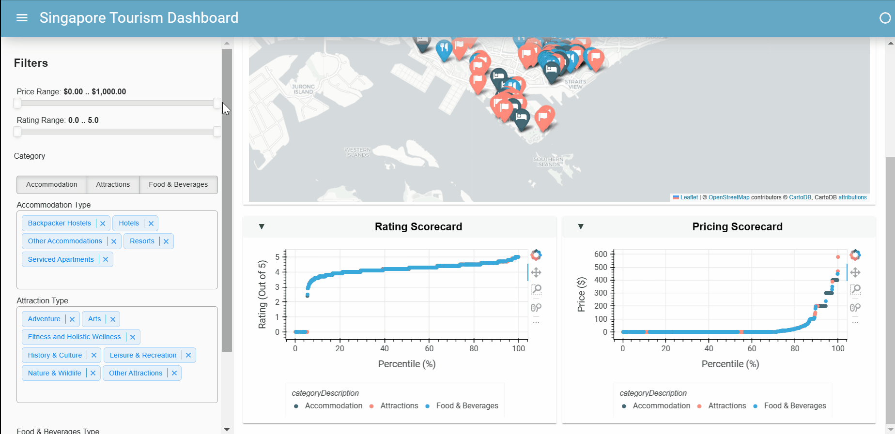

# Singapore Tourism Dashboard

This project explores the creation of an interactive Data Visualisation Dashboard using Tourism Listing data from the Singapore Tourism Board (STB) Tourism Information & Services Hub (TIH).

**Singapore Tourism Map:**\
Locations of Attractions, Accomodation and F&B Listings plotted across the Map of Singapore


\
**Rating / Price Scorecard:**\
Scatterplots of the Rating & Price Scores and Percentile of Tourism Listings

## Launch Dashboard

After running the Jupyter Notebook, to launch the Dashboard locally, run the following in Terminal (Command Prompt).

```
panel serve Singapore_Tourism_Map_Visualisation.ipynb
```
## Techniques
- Data Ingestion from API
- Data Cleaning Pipeline including RegEx
- Interactive Dashboard (Panel Library)
- Map Visualisation (Folium Library)
- Graph Visualisation (hvPlot Library)
## Future Roadmap

- Add Name Search to highlight specific Tourism Listings on visualisations
- Add Sentiment Analysis / Categorisation of Tourism Listing's Review Comments 


## Acknowledgements

- [Panel - Folium](https://panel.holoviz.org/gallery/external/Folium.html)
- [Thu Vu data analytics - Panel/Hvplot Tutorial](https://www.youtube.com/watch?v=uhxiXOTKzfs)


## Contributors

- Lim Yu Bin [(@lim-yb)](https://github.com/lim-yb)
